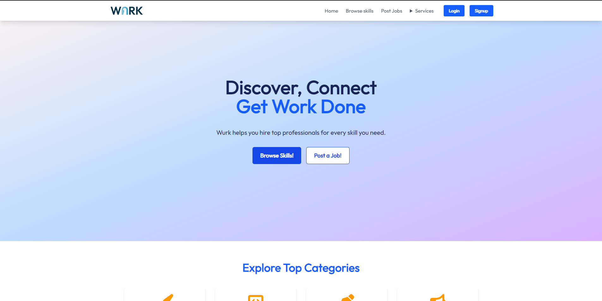
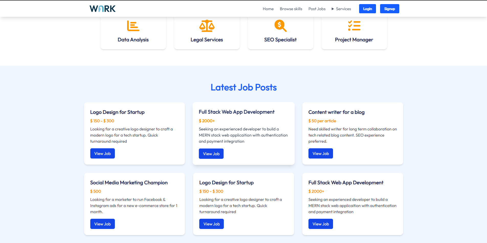
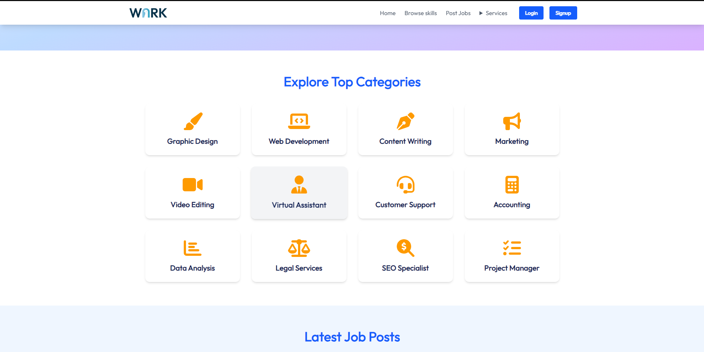
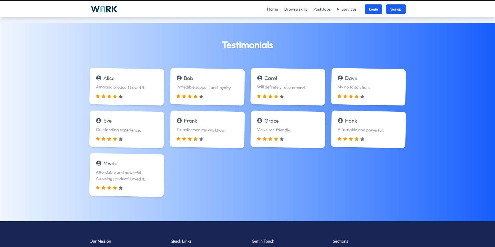

# Wurk – Freelance Marketplace Frontend (Practice Project)

Wurk is a frontend-only React practice project inspired by freelance marketplaces like Upwork and Fiverr.  
This project focuses on UI structure, component composition, and layout design.

> ⚠️ Status: Incomplete / Frontend Practice Project

---

## 🔥 Features Implemented

- Responsive landing page UI
- Job listing cards
- Skill categories section
- Testimonials section
- Static navigation (Home, Browse Skills, Post Jobs, Login, Signup)
- Footer with contact details and quick links

---

## 🛠️ Tech Stack

- React
- JavaScript (ES6+)
- HTML5
- CSS3

---

## 🚧 Features Pending

- Authentication (Login / Signup logic)
- Backend integration
- Job posting functionality
- Dynamic job listings (API driven)
- Payments
- User dashboards

---

## 📸 Screenshots

_Not added yet_
### Home Page


### Job Listings


### Categories Section


### Testimonials


---

## 🚀 Getting Started (Local Setup)

```bash
git clone https://github.com/your-username/wurk-frontend.git
cd wurk-frontend
npm install
npm start

📚 Purpose of This Project

Frontend practice with React

Component-based UI thinking

Preparation for full-stack MERN applications

📌 Notes

This is a learning project, not a production-ready application.

👤 Author

Mwita Alex Marwa
Frontend Developer | Medical Student
Kenya 🇰🇪

📄 License

This project is open for learning and personal use.


---

## 2) Prepare Your Local Project

From **inside your project folder**:

```bash
ls